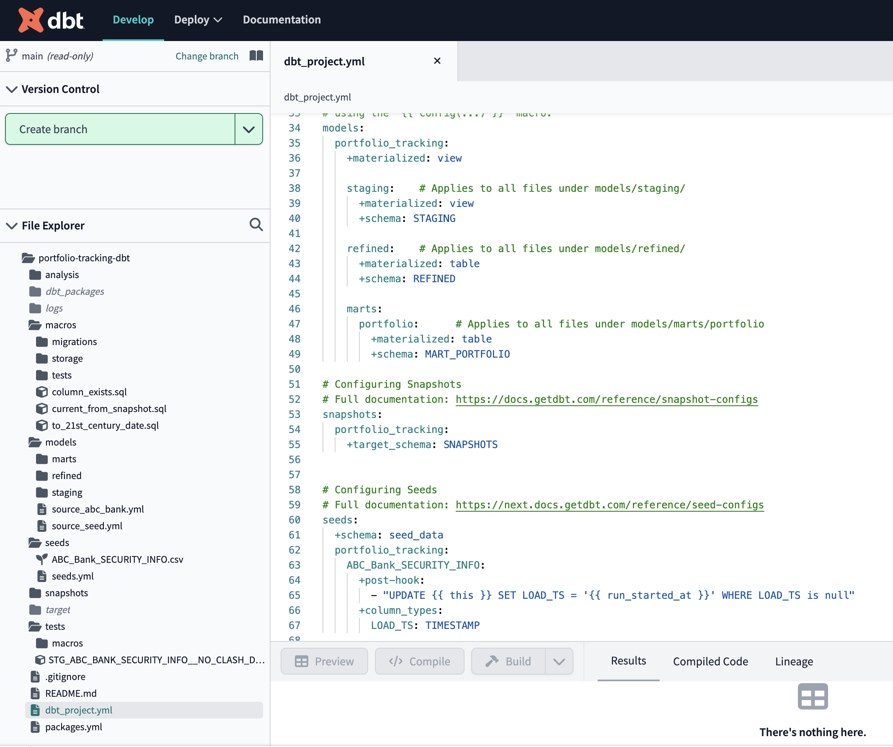

#Data Engineering with dbt 

<a href="https://www.amazon.com/Data-Engineering-dbt-cloud-based-dependable/dp/1803246286/ref=tmm_pap_swatch_0?_encoding=UTF8&qid=1688627636&sr=8-1&utm_source=github&utm_medium=repository&utm_campaign=9781801810135"></a>

This is the code repository for [Data Engineering with dbt](https://www.amazon.com/Data-Engineering-dbt-cloud-based-dependable/dp/1803246286/ref=tmm_pap_swatch_0?_encoding=UTF8&qid=1688627636&sr=8-1&utm_source=github&utm_medium=repository&utm_campaign=9781801810135), published by Packt.

**A practical guide to building a cloud-based, pragmatic, and dependable data platform with SQL**

## What is this book about?

This book covers the following exciting features:
Create a dbt Cloud account and understand the ELT workflow
Combine Snowflake and dbt for building modern data engineering pipelines
Use SQL to transform raw data into usable data, and test its accuracy
Write dbt macros and use Jinja to apply software engineering principles
Test data and transformations to ensure reliability and data quality
Build a lightweight pragmatic data platform using proven patterns
Write easy-to-maintain idempotent code using dbt materialization

If you feel this book is for you, get your [copy](https://www.amazon.com/dp/1803246286) today!

<a href="https://www.packtpub.com/?utm_source=github&utm_medium=banner&utm_campaign=GitHubBanner"></a>

## Instructions and Navigations
All of the code is organized into folders. For example, Chapter01.

The code will look like the following:
```
CREATE TABLE ORDERS ( 
   ORDER_ID NUMBER, 
   CUSTOMER_CODE TEXT, 
   TOTAL_AMOUNT FLOAT, 
   ORDER_DATE DATE, 
   CURRENCY TEXT DEFAULT 'EUR' 
); 
```

**Following is what you need for this book:**
This book is for data engineers, analytics engineers, BI professionals, and data analysts who want to learn how to build simple, futureproof, and maintainable data platforms in an agile way. Project managers, data team managers, and decision makers looking to understand the importance of building a data platform and foster a culture of high-performing data teams will also find this book useful. Basic knowledge of SQL and data modeling will help you get the most out of the many layers of this book. The book also includes primers on many data-related subjects to help juniors get started.

With the following software and hardware list you can run all code files present in the book (Chapter 1-15).
### Software and Hardware List
| Chapter | Software required | OS required |
| -------- | ------------------------------------ | ----------------------------------- |
| 1-15 | dbt | Windows, MacOS or Linux  |


We also provide a PDF file that has color images of the screenshots/diagrams used in this book. [Click here to download it]().

### Related products
*  [[Data Engineering with AWS]](https://www.packtpub.com/product/data-engineering-with-aws/9781800560413?utm_source=github&utm_medium=repository&utm_campaign=9781800560413) [[Amazon]](https://www.amazon.com/dp/1804614424)

*  [[Data Engineering with Python]](https://www.packtpub.com/product/data-engineering-with-python/9781839214189?utm_source=github&utm_medium=repository&utm_campaign=9781839214189) [[Amazon]](https://www.amazon.com/dp/183921418X)


## Get to Know the Author
**Roberto Zagni**
is a senior leader with extensive hands-on experience in data architecture, software development and agile methodologies. Roberto is an Electronic Engineer by training with a special interest in bringing software engineering best practices to cloud data platforms and growing great teams that enjoy what they do. He has been helping companies to better use their data, and now to transition to cloud based Data Automation with an agile mindset and proper SW engineering tools and processes, aka DataOps. Roberto also coaches data teams hands-on about practical data architecture and the use of patterns, testing, version control and agile collaboration. Since 2019 his go to tools are dbt, dbt Cloud and Snowflake or BigQuery.


# Data Engineering with dbt - Code Samples
This repository contains code samples for the book **Data Engineering with dbt** by Roberto Zagni, published by PacktPublishing.

Please look up the [LICENSE](LICENSE) before using this repository.

## Organization of this Repository
This is not the repository for the dbt project used as a sample in the book, even if it includes the code for that project.
At the end of this readme there is a small presentation of [the sample dbt project](#the-sample-dbt-project) 

The files in this repo represents the **evolution of the code** as discussed in the different chapters of the book.
Because of that the files are organized by book chapter.

When one source file undergoes many substantial changes in a chapter we have provided multiple versions of the file to
represent the multiple stages discussed in the chapter.

### Samples from the introductory chapters
In the first chapters we introduce Snowflake and dbt and the samples are about snippets of code, 
so we have provided one file per section as often individual snippets are too tiny to justify a single file per sample.
Longer samples can be in their own file.

### Code from the remaining chapters
In chapter 5 we start the sample dbt project and from that point onward each file in this repo represents
one version of a file in the dbt project or a sample that we have discussed even if not part of the sample project.

Inside each chapter the files that represent dbt objects (models, macros and others) are under a `dbt` folder, 
while other files that might represent CSV files or commands to be executed in Snowflake are in separate folders. 

In the early phases of the sample project we have few models, so they all are under the `dbt` folder.
When we have multiple types of dbt object we have placed each type of file in its sub-folder. 


## The sample dbt project
The book **Data Engineering with dbt** uses a sample project to describe how dbt works with a practical approach.

The sample starts simple and then is evolved introducing more dbt features and software engineering best practices.

The sample is not intended to be a full fledged project, but just a tool to discuss ho to approach the building 
of real dbt projects applying the right features and best practices.

As such the sample project uses few dbt models and evolves them by introducing new dbt features 
and explaining the software engineering principles that guide the evolution of the models or the use of one 
feature instead of another.

In the book we often refer to the organization of the sample project, including folder names.
The layout of the sample dbt project described in the book can be seen in the following picture: 




